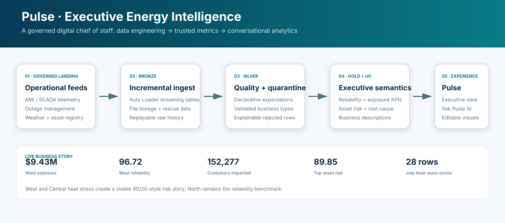
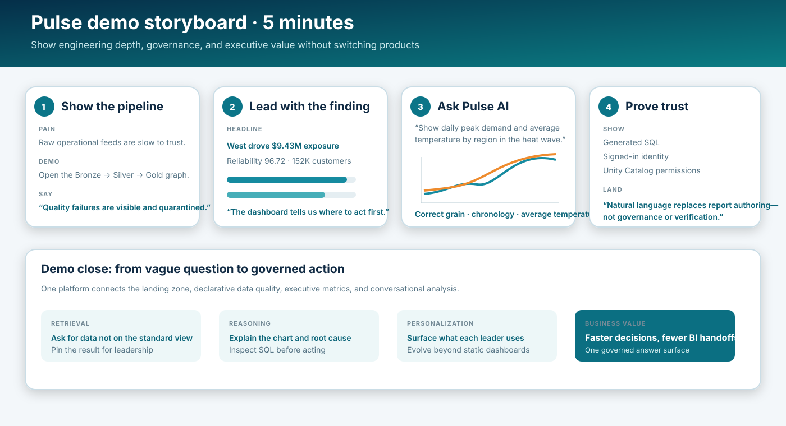

# Pulse — Executive Energy Intelligence (Version 2)

> Canonical active version: `app-pwb8_2026_09_29-16_44`. Version 1 is frozen. See [VERSION_POLICY.md](VERSION_POLICY.md).

A governed Databricks demo that turns grid telemetry, outage, asset, and weather data into executive KPIs and editable Genie visualizations. It demonstrates end-to-end data engineering, Unity Catalog semantics, natural-language analytics, and a production-style AppKit experience.

[](https://app-pwb8-7474656067656578.aws.databricksapps.com)
[](https://dbc-61514402-8451.cloud.databricks.com/)



## What the demo proves

- Incremental operational data flows through Bronze, Silver, and Gold using a Lakeflow Spark Declarative Pipeline.
- Silver expectations reject invalid telemetry into explainable quarantine tables.
- Unity Catalog business descriptions improve generated SQL and make metrics discoverable.
- Executives can cross-filter regional exposure, root causes, and asset risk without authoring a report.
- Genie converts plain English into governed SQL, chronological time-series data, and editable visuals.
- Answers show signed-in identity, generated SQL, and an AI-verification notice.

## Live business story

| Region | Financial exposure | Reliability | Customers impacted |
|---|---:|---:|---:|
| West | $9.43M | 96.72 | 152,277 |
| Central | $7.72M | 97.35 | 124,467 |
| South | $3.25M | 99.33 | 48,990 |
| North | $2.50M | 99.50 | 37,455 |

The synthetic data deliberately tells a story: West and Central experience disproportionate heat-wave stress, North provides the reliability benchmark, and asset-risk scores retain meaningful separation instead of saturating at 100.

## Five-minute demo visual

Use this as the interview talk track. Open the image in a separate tab or place it directly into a slide.

[](docs/pulse-demo-storyboard.svg)

### Interactive executive-dashboard prototype

[Open the interactive Pulse demo](docs/pulse-interactive-demo.html) to present the redesigned executive experience without requiring a live Databricks connection. It includes:

- Executive KPIs with targets, trends, and clear status semantics
- Regional exposure, root-cause analysis, and differentiated asset risk
- One-click pinning into a custom board report
- A Pulse AI trust panel with generated-SQL, edit-visualization, OBO, and verification cues
- Observability and three presentation tones: tonal, neutral, and dark

For the best interview experience, open `docs/pulse-interactive-demo.html` locally in Chrome and use the dashboard, report, observability, and AI navigation live.

Recommended Genie question:

> Show a line chart of daily peak demand and average temperature by service region during the July heat wave.

The verified response contains `metric_date`, `service_region`, `peak_demand_mw`, and `avg_temperature_f`, ordered chronologically with one series per region.

## Architecture

```text
UC landing volume
      ↓ Auto Loader
Bronze streaming tables
      ↓ expectations and cleansing
Silver validated views + quarantine
      ↓ governed aggregations
Gold executive KPIs, risk, root cause, load/weather
      ├── Pulse executive dashboard
      └── Genie natural-language analytics
```

## Application components

- **Frontend:** AppKit UI, React, TypeScript, Vite, and responsive Databricks chart components
- **Runtime:** dependency-free Node.js HTTP adapter for the deployed snapshot
- **Analytics:** Databricks SQL Statements API against governed Gold objects
- **Conversational BI:** Databricks Genie Conversation API
- **Security:** signed-in scoped user access and Unity Catalog authorization

## Prerequisites

- Node.js v22+ and npm
- Databricks CLI (for deployment)
- Access to a Databricks workspace

## Databricks Authentication

### Local Development

For local development, configure your environment variables by creating a `.env` file:

```bash
cp .env.example .env
```

Edit `.env` and set the environment variables you need:

```env
DATABRICKS_HOST=https://your-workspace.cloud.databricks.com
DATABRICKS_APP_PORT=8000
# ... other environment variables, depending on the plugins you use
```

### CLI Authentication

The Databricks CLI requires authentication to deploy and manage apps. Configure authentication using one of these methods:

#### OAuth U2M

Interactive browser-based authentication with short-lived tokens:

```bash
databricks auth login --host https://your-workspace.cloud.databricks.com
```

This will open your browser to complete authentication. The CLI saves credentials to `~/.databrickscfg`.

#### Configuration Profiles

Use multiple profiles for different workspaces:

```ini
[DEFAULT]
host = https://dev-workspace.cloud.databricks.com

[production]
host = https://prod-workspace.cloud.databricks.com
client_id = prod-client-id
client_secret = prod-client-secret
```

Deploy using a specific profile:

```bash
databricks bundle deploy --profile production
```

**Note:** Personal Access Tokens (PATs) are legacy authentication. OAuth is strongly recommended for better security.

## Getting Started

### Install Dependencies

```bash
npm install
```

### Development

Run the app in development mode with hot reload:

```bash
npm run dev
```

The app will be available at the URL shown in the console output.

### Build

Build both client and server for production:

```bash
npm run build
```

This creates:

- `dist/server.js` - Compiled server bundle
- `client/dist/` - Bundled client assets

### Production

Run the production build:

```bash
node server.mjs
```

## Code Quality

There are a few commands to help you with code quality:

```bash
# Type checking
npm run typecheck

# Linting
npm run lint
npm run lint:fix

# Formatting
npm run format
npm run format:fix
```

## Deployment

### 1. Configure Bundle

Update `databricks.yml` with your workspace settings:

```yaml
targets:
  default:
    workspace:
      host: https://your-workspace.cloud.databricks.com
```

Make sure to replace all placeholder values in `databricks.yml` with your actual resource IDs.

### 2. Deploy

Build the client, upload the deployable files, and deploy the `app-pwb8` resource. The current production snapshot uses `app.yaml`, `server.mjs`, `client/dist`, and `config/queries`.

```bash
databricks apps deploy app-pwb8 \
  --source-code-path /Workspace/Users/<user>/databricks_apps/app-pwb8-v2-node-20260929 \
  --mode SNAPSHOT
```

`databricks apps deploy` validates the project, deploys it, starts the app, and prints its URL.

### Deploy to Production

1. Configure the production target in `databricks.yml`
2. Deploy to production:

```bash
databricks apps deploy -t prod
```

> **Restarting a stopped app:** apps stop after a period of inactivity. To start one again without redeploying, run `databricks apps start <APP_NAME>`.

## Project structure

```
├── client/src/             # Version 2 React application
├── config/queries/         # Governed executive SQL
├── docs/                   # README and interview visuals
├── lakehouse/              # Synthetic data, declarative pipeline, orchestration
├── server.mjs              # Dependency-free production API adapter
├── app.yaml                # Databricks Apps runtime configuration
├── databricks.yml          # App resource and governed bindings
└── VERSION_POLICY.md       # Version 1 freeze and Version 2 guardrails
```

## Validation

```bash
npm run typecheck
npm test
npm run build
```

The deployed Version 2 snapshot and the exact Genie heat-wave question were validated end-to-end against `finserv.energy_pulse`.
